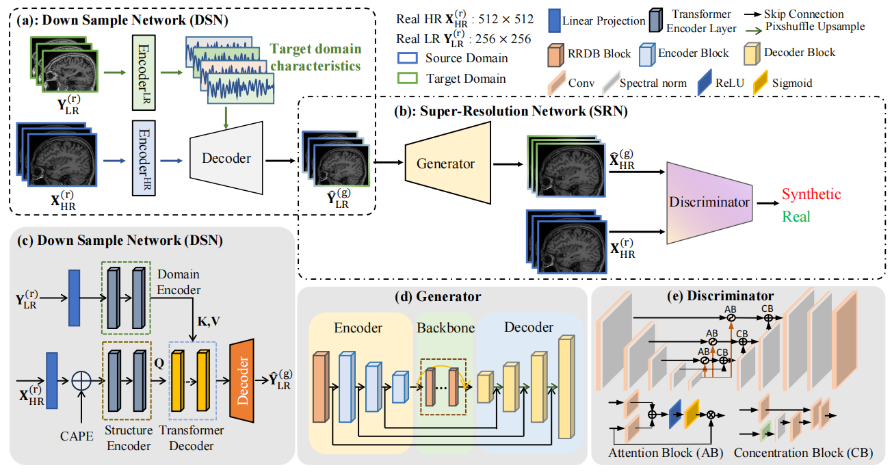

# DDASR: Domain-Distance Adapted Super-Resolution Reconstruction of MR Brain Images

High detail and fast magnetic resonance imaging (MRI) sequences are highly demanded in clinical settings, as inadequate imaging information can lead to diagnostic challenges. MR image super-resolution (SR) is a promising approach to address this issue, but its performance is limited by the practical difficulty of acquiring paired low- and high-resolution (LR and HR) images. Most existing methods generate these pairs by down-sampling HR images, which often fails to capture complex degradations and domain-specific variations. In this study, we propose a domain-distance adapted SR framework (DDASR), which consists of two stages: the domain-distance adapted down-sampling network (DSN) and the GAN-based super-resolution network (SRN). The DSN incorporates characteristics from unpaired LR images during the down-sampling process, enabling the generation of domain-adapted paired LR images. Furthermore, we introduce a novel GAN with an enhanced attention U-Net and multi-scale perceptual loss. The proposed approach yields visually convincing textures and successfully restores 1.5T LR MRI data from the ADNI dataset, outperforming state-of-the-art SR approaches in both perceptual and quantitative evaluations.
The code will be released after the paper is accepted.

## Framework

## Implementation details

Our proposed model is trained on 2 NVIDIA GeForce RTX 3090 GPUs with 48 GB memory using the PyTorch.

## Dataset

ADNI1 can be accessed from official. https://adni.loni.usc.edu/

## Results presentation
### Comparison with the state-of-the-arts
We perform super-resolution on the ADNI1 image and compare it with other models to achieve SOTA.
!]

### Our DSN Synthesizes More Realistic LR Image
We compared the downsampling network and proved that our downsampling network can generate more realistic LR images.

### Other results

We also conducted ablation experiments on the model to verify the effectiveness of each module and component, see the article for details.

## Quick Use

### Requirements

- python 3.6
- pytorch 1.4.0
- PIL, numpy, scipy

### Hyper parameters

The hyper parameters will be released after the paper is accepted.

### Test

Pretrained models:

**DSN Test Command:**

`python DSN/test.py  --structure_dir input/dataset/ --texture_dir input/texture_dataset/  --output out`

**SRN Test Command:**

`python SRN/test.py --ops SRN/options/DDASR.yml --model_path=pretrained_models/DDASR.pth --input=inputs`

## Acknowledgments

This tool is developed in Yao Lab. We thank all the contributors and collaborators for their support.

