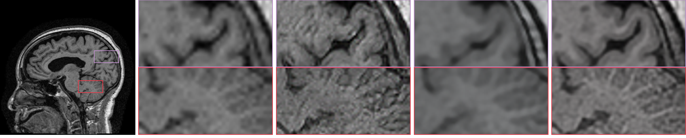

# Domain-Distance Adapted Super-Resolution Reconstruction of Low-Field MR Brain Images

  Low-field and fast magnetic resonance imaging (MRI) sequences are in high clinical demand, but inadequate imaging information can cause diagnostic difficulties. A viable path to addressing this challenge is MR image super-resolution, but unlike its success in enhancing natural images, its performance on MR images is limited due to the practical difficulty of acquiring paired low- and high-resolution (LR and HR) images.  
  We proposes a **domain-distance adapted super-resolution framework for low-field MR brain images based on real but unpaired HR/LR images**. With the ability to learn the abstract representation of arbitrary real LR images, it is feasible to identify realistic downsampling. In addition, we incorporate a novel **encoder-backbone-decoder based generator and multi-scale perceptual loss**, which further yields visually convincing textures.   
  The proposed method is validated on a large publicly available brain MRI dataset, in which it successfully restores outdated low-field MRI data. The experimental results demonstrate that our proposed method is perceptually and quantitatively superior to state-of-the-art super-resolution approaches on MRI data. 

## Results presentation

!](figures/result.png)

## Framework

## Quick Use

### Requirements

- python 3.6
- pytorch 1.4.0
- PIL, numpy, scipy

### Test

Pretrained models:

**DSN Test Command:**

`python DSN/test.py  --structure_dir input/dataset/ --texture_dir input/texture_dataset/  --output out`

**SRN Test Command:**

`python SRN/test.py --ops SRN/options/DDASR.yml --model_path=pretrained_models/DDASR.pth --input=inputs`

